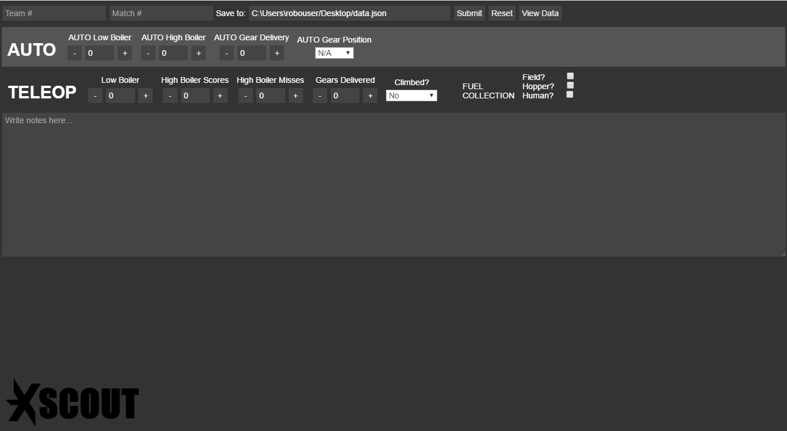

# XScout
Application for FRC scouting. Written using [Electron](http://electron.atom.io/) for easy customization.

Get the newest compiled version [here](https://github.com/Team612/XScout/releases)!

Download `xs`, a convenient CLI app for processing XScout data, [here](https://github.com/WardBenjamin/xs).

## Development dependencies
* [Node.js](https://nodejs.org)
* [npm](https://npmjs.com)

## Development Installation
1. `cd` into `XScout` directory
2. Run `npm install` to install node dependencies.

## Usage in Development
While in `XScout` directory, run

    npm start

## Packaging
While in `XScout` directory, run

    npm run-script package

If you'd like to only package for one OS, append `-mac`, `-win`, or `-linux` to the end of `package` in that command. Otherwise, packages will be created for all operating systems.

See [here](https://github.com/electron-userland/electron-packager#readme) for an explanation of how to modify your packaging settings.

## Authors
This software was originally written by [Erik Boesen](https://github.com/ErikBoesen), as [VictiScout](https://github.com/frc1418/VictiScout) for [Team 1418](https://github.com/frc1418).

It's since been expanded on by the following authors:
* [Benjamin Ward, 612](https://github.com/WardBenjamin)
* [Adrian Hall, 1418](https://github.com/aderhall)
* [Tate Ward, 1418](https://github.com/MoonMoon2)
* [Tim Winters, 1418](https://github.com/Twinters007)

## License
This software is licensed under the MIT license. More information in [`LICENSE`](LICENSE).
